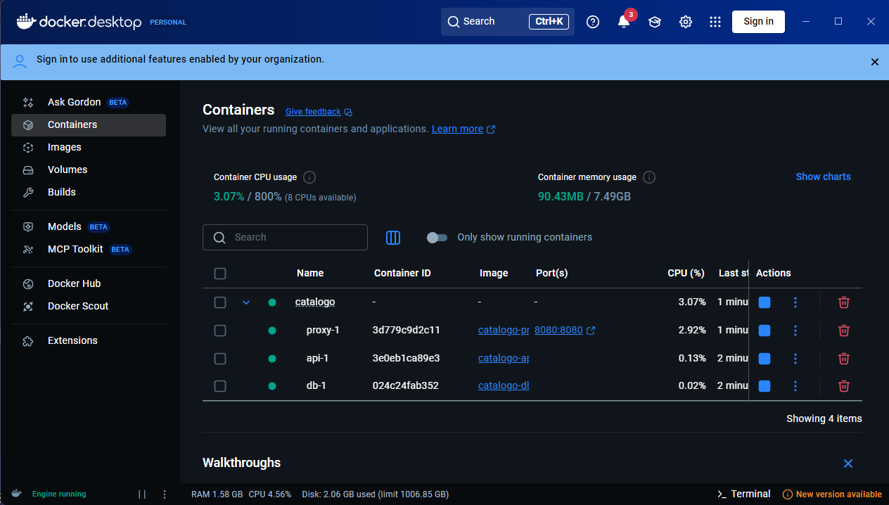
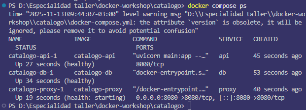
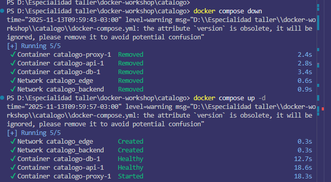
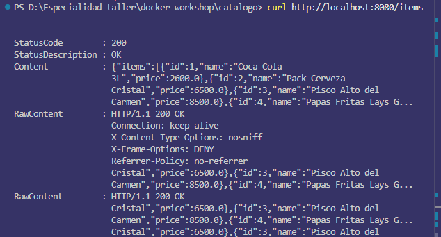
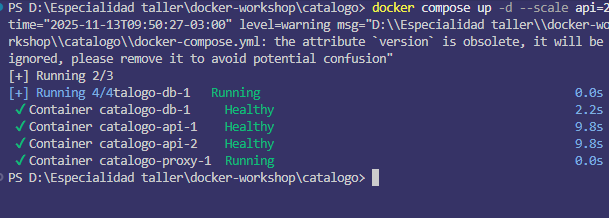
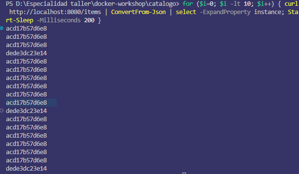

# Evidencias de Implementación

## 1. Estado de los Contenedores

Ejecutando `docker compose ps` podemos ver todos los servicios funcionando:

```bash
$ docker compose ps
NAME               IMAGE            COMMAND                  SERVICE   CREATED              STATUS
catalogo-api-1     catalogo-api     "uvicorn main:app --…"   api       About a minute ago   Up About a minute (healthy)
catalogo-db-1      catalogo-db      "docker-entrypoint.s…"   db        About a minute ago   Up About a minute (healthy)
catalogo-proxy-1   catalogo-proxy   "/docker-entrypoint.…"   proxy     About a minute ago   Up About a minute
```



## 2. Verificación de Healthchecks

Los logs muestran que los healthchecks están funcionando correctamente:



## 3. Endpoint /items y Persistencia

### 3.1 Prueba inicial del endpoint /items:

```bash
PS D:\Especialidad taller\docker-workshop\catalogo> curl http://localhost:8080/health


StatusCode        : 200
StatusDescription : OK
Content           : {"status":"ok"}
RawContent        : HTTP/1.1 200 OK
                    Connection: keep-alive
                    X-Content-Type-Options: nosniff
                    X-Frame-Options: DENY
                    Referrer-Policy: no-referrer
                    X-Request-ID: 38678c88ee2fed1321fa3d49629fc8a4
                    Content-Length: 15
                    Conte...
Forms             : {}
Headers           : {[Connection, keep-alive], [X-Content-Type-Options, nosniff],     
                    [X-Frame-Options, DENY], [Referrer-Policy, no-referrer]...}       
Images            : {}
InputFields       : {}
Links             : {}
ParsedHtml        : mshtml.HTMLDocumentClass
RawContentLength  : 15
```

```bash
PS D:\Especialidad taller\docker-workshop\catalogo> curl http://localhost:8080/items | ConvertFrom-Json

items
-----
{@{id=1; name=Coca Cola 3L; price=2600}, @{id=2; name=Pack Cerveza Cristal... 
```

### 3.2 Prueba de persistencia:
1. Detener los contenedores: `docker compose down`
2. Volver a iniciar: `docker compose up -d`
3. Verificar que los datos persisten: `curl http://localhost:8080/items`




## 4. Escalamiento y Balanceo

### 4.1 Escalar a dos réplicas:
```bash
$ docker compose up -d --scale api=2
```


### 4.2 Verificar balanceo:
```bash
# Primera petición
for ($i=0; $i -lt 10; $i++) { curl http://localhost:8080/items | ConvertFrom-Json | select -ExpandProperty instance; Start-Sleep -Milliseconds 200 }
```



El balanceo se evidencia por diferentes IDs de request alternando entre las dos instancias.